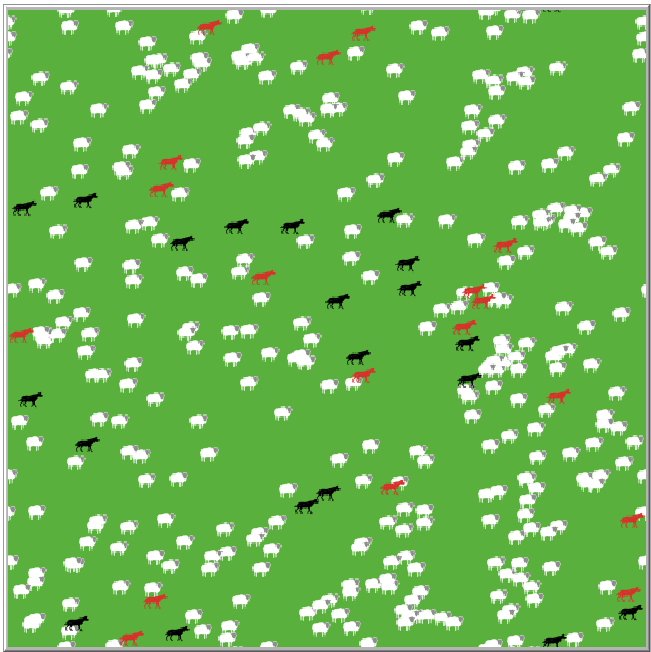

## Комп'ютерні системи імітаційного моделювання
## СПм-22-4, **Уваров Георгій Олексійович**
### Лабораторна робота №**2**. Редагування імітаційних моделей у середовищі NetLogo

 

### Варіант 7, модель у середовищі NetLogo:
Wolf Sheep Predation. Прибрати "зграйність" вовків - тепер перед початком свого ходу вовки повинні "оглядатися", перевіряючи оточення, та обирати напрямок руху виходячи з наявності вівець та відсутності інших вовків. Якщо немає іншої можливості – переміщається випадково. При знаходженні на одній ділянці поля двох вовків залишається лише один з них. Вівці переміщаються випадковим чином, але при виявленні вовка на одній із клітин поруч змінюють напрямок на протилежний.

 

### Внесені зміни у вихідну логіку моделі, за варіантом:

**Вівці обходять вовків**

<pre>
to avoid-wolves   ; wolf procedure
  ifelse sum [count wolves-here] of neighbors = 0 [
    move;
  ]
  [
    repeat 4 [
      if (any? wolves in-cone 1.2 90 ) [
        rt 90;
      ]
    ]
    fd 1;
  ]
end
</pre>

**Вовки обходять вовків та шукають овець**

<pre>
to seek-sheep   ;   wolf procedure
  ifelse sum [count sheep-here] of neighbors = 0 [
    if not (any? sheep-here)[
      set color black;
      move; move randomly
    ]
  ]
  [
    set color red;
    repeat 6 [
      if not (any? sheep in-cone 2 60 ) [
        rt 60;
      ]
      if (any? wolves in-cone 2 60 ) [
        rt 60;
      ]
    ]
    fd 1;
  ]
end
</pre>

### Внесені зміни у вихідну логіку моделі, на власний розсуд:

**1.Вовки, що рухаються цілеспрямовано, красяться у червоний**.

<pre>
to seek-sheep   ;   wolf procedure
  ifelse sum [count sheep-here] of neighbors = 0 [
    if not (any? sheep-here)[
      set color black;
      move; move randomly
    ]
  ]
  [
    set color red;
    repeat 6 [
      if not (any? sheep in-cone 2 60 ) [
        rt 60;
      ]
      if (any? wolves in-cone 2 60 ) [
        rt 60;
      ]
    ]
    fd 1;
  ]
end
</pre>

**2.Вовки переслідують овець на будь-якій відстані**

<pre>
to seek-sheep   ;   wolf procedure
  ifelse sum [count wolves-here] of neighbors > 0 [
      avoid-wolves; wolves shouldn't run together
  ]
  [; no wolves in vicinity
    ifelse not (any? sheep) [
      set color black;
      move; move randomly
    ]
    [; there are sheep
      set color red;
      move-to min-one-of other sheep [distance myself] ; aim at the closest shee
      fd 1; chase
    ]
  ]
end

to avoid-wolves   ; sheep procedure
  ifelse sum [count wolves-here] of neighbors = 0 [
    move; move randomly
  ]
  [; there are wolves
    move-to min-one-of other wolves [distance myself] ; aim at the closest wolf
    fd -1; walk backwards
  ]
end
</pre>

## Обчислювальні експерименти
*// тут повинен бути наведений опис одного експерименту, за аналогією з першої л/р.* 
### 1. Вплив цілеспрямованості агентів на швидкість зростання популяції овець (до 200)

<table>
  <tr><th>№</th><th>Original</th><th>Переслідування у сусідніх (1)</th><th>Переслідування здалеку (2)</th></tr>
  <tr><td>1</td><td>45</td><td>24</td><td>35</td></tr>
  <tr><td>2</td><td>32</td><td>34</td><td>31</td></tr>
  <tr><td>3</td><td>35</td><td>29</td><td>54</td></tr>
  <tr><td>4</td><td>26</td><td>28</td><td>35</td></tr>
  <tr><td>5</td><td>29</td><td>33</td><td>49</td></tr>
  <tr><td>6</td><td>29</td><td>29</td><td>49</td></tr>
  <tr><td>7</td><td>40</td><td>21</td><td>43</td></tr>
  <tr><td>8</td><td>39</td><td>24</td><td>49</td></tr>
  <tr><td>9</td><td>30</td><td>28</td><td>79</td></tr>
  <tr><td>10</td><td>26</td><td>26</td><td>55</td></tr>
  <tr><td>AVG</td><td>33.1</td><td>27.6</td><td>47.9</td></tr>
</table>
